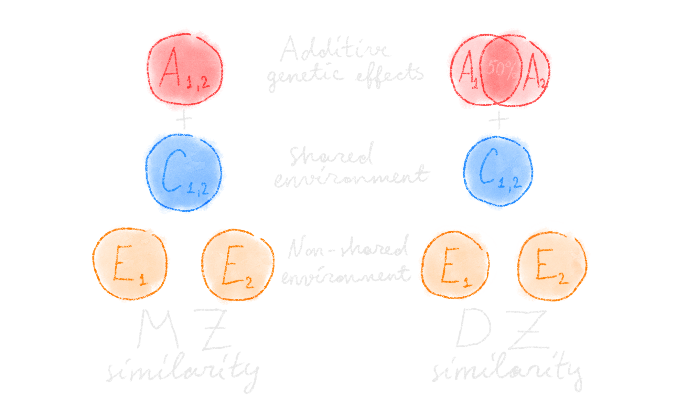
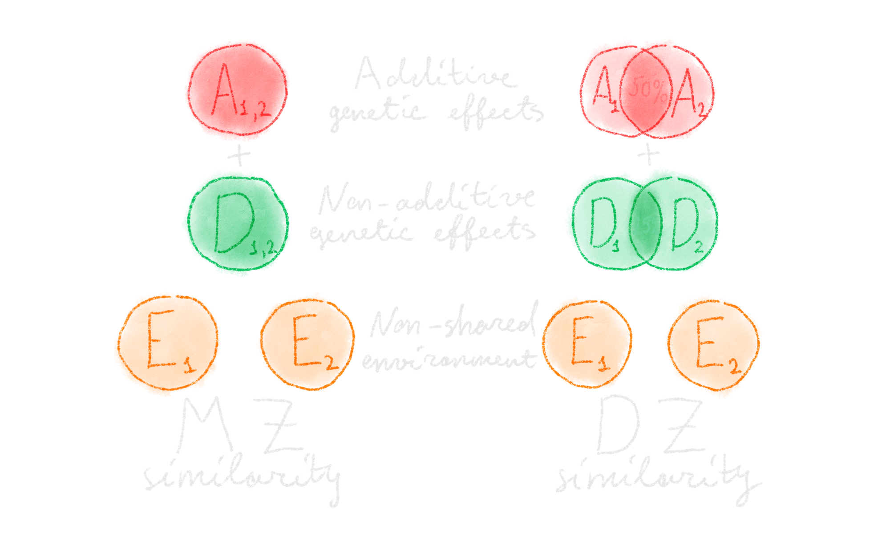
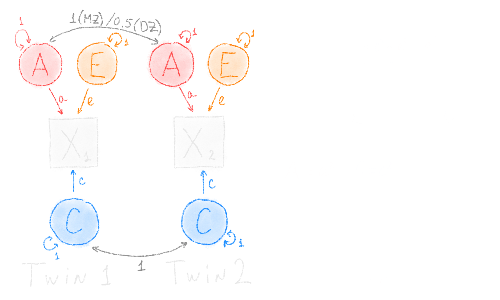
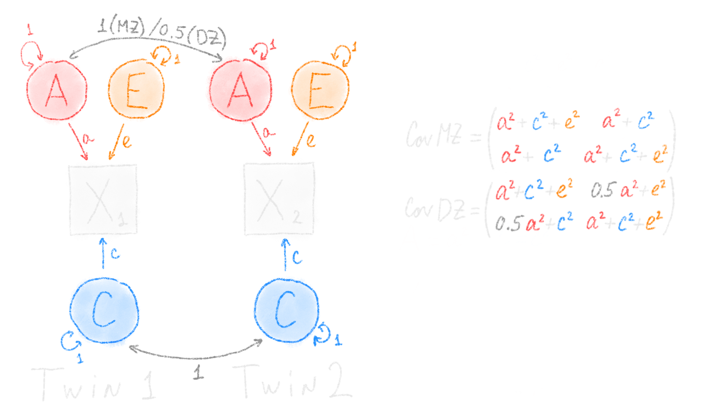
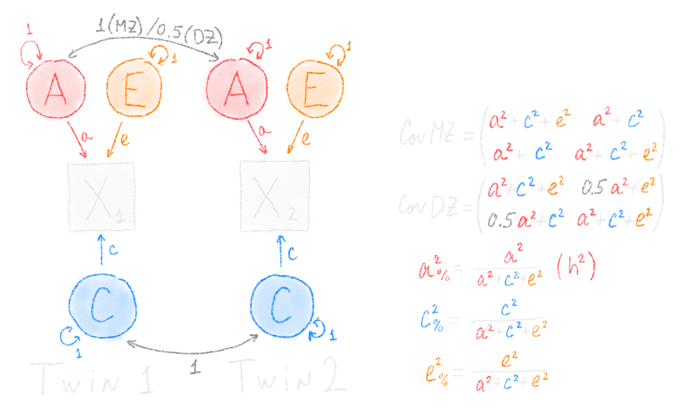
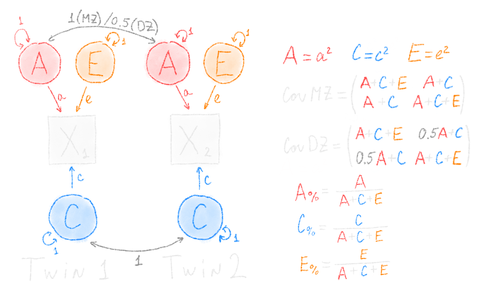

```{r include=FALSE, purl=FALSE}
options(width = 59)
knitr::opts_chunk$set(
  message = FALSE,
  class.source = 'numberLines numberSource',
  collapse = TRUE
)
```


## Contents

- [Twin method: Fundamentals](#/twin-method-fundamentals)
- [`TwinAnalysis`](#/twinanalysis)
- [`OpenMx`](#/openmx)
- [`mlth.data.frame`](#/mlth.data.frame)

<br>

The R code from this presentation is here:
[https://raw.githubusercontent.com/IvanVoronin/TwinAnalysis/master/slides/intro/intro.R](https://raw.githubusercontent.com/IvanVoronin/TwinAnalysis/master/slides/intro/intro.R)


# Twin method: Fundamentals


## ACE

{width=100%}

## ADE

{width=100%}

## Univariate ACE


## Univariate ACE




## Univariate ACE




## Univariate ACE




## Univariate ACE



# TwinAnalysis

## Univariate toy data

```{r}
# Making univariate toy data
library(dplyr,
        quietly = TRUE)

mz_data <- MASS::mvrnorm(
  n = 100,
  mu = c(0, 0),
  Sigma = matrix(c(1.0, 0.8,
                   0.8, 1.0),
                 nrow = 2)) %>%
  as.data.frame() %>%
  setNames(c('X1', 'X2'))

dz_data <- MASS::mvrnorm(
  n = 100,
  mu = c(0, 0),
  Sigma = matrix(c(1.0, 0.5,
                   0.5, 1.0),
                 nrow = 2)) %>%
  as.data.frame() %>%
  setNames(c('X1', 'X2'))

data <- rbind(data.frame(zyg = 'MZ', mz_data),
              data.frame(zyg = 'DZ', dz_data)) %>%
  mutate(
    zyg = factor(zyg, levels = c('MZ', 'DZ'))
  )

head(data)
```


## Descriptives

```{r}
# Installing the packages
# install.packages('devtools')
# library(devtools)
# install_github('ivanvoronin/mlth.data.frame')
# install_github('ivanvoronin/TwinAnalysis')

# Loading the packages
library(OpenMx)
library(TwinAnalysis)

# Descriptive statistics
get_univ_descriptives(data, zyg = 'zyg', vars = 'X')
```


## Univariate ACE

```{r}
# Univariate ACE model
model <- univariate_ace(data, zyg = 'zyg', ph = 'X')

model <- mxRun(model)

summary(model)
```


## Output - parameters

```{r}
# Output tables from the univariate ACE
get_output_tables(model)
```


## Output - model fit

```{r}
# Model fit
model <- ref_models(model)

fit_stats(model)
```


## Constrained models

```{r}
# Constrained models
# This is a list of MxModels
nested_models <- def_nested_models(
  model,
  AE = mxConstraint(c[1, 1] == 0),
  CE = mxConstraint(a[1, 1] == 0),
  E = list(mxConstraint(c[1, 1] == 0),
           mxConstraint(a[1, 1] == 0)),
  run = TRUE
)

fit_stats(model, nested_models = nested_models)
```


## Bivariate toy data

```{r}
# Making bivariate toy data
mz_data2 <- MASS::mvrnorm(
  n = 100,
  mu = c(0, 0, 0, 0),
  Sigma = matrix(
    c(1.0, 0.7, 0.6, 0.5,
      0.7, 1.0, 0.5, 0.8,
      0.6, 0.5, 1.0, 0.7,
      0.5, 0.8, 0.7, 1.0),
    nrow = 4)) %>%
  as.data.frame() %>%
  setNames(c('X1', 'Y1', 'X2', 'Y2'))

dz_data2 <- MASS::mvrnorm(
  n = 100,
  mu = c(0, 0, 0, 0),
  Sigma = matrix(
    c(1.0, 0.7, 0.4, 0.2,
      0.7, 1.0, 0.2, 0.4,
      0.4, 0.2, 1.0, 0.7,
      0.2, 0.4, 0.7, 1.0),
    nrow = 4)) %>%
  as.data.frame() %>%
  setNames(c('X1', 'Y1', 'X2', 'Y2'))

data2 <- rbind(data.frame(zyg = 'MZ', mz_data2),
               data.frame(zyg = 'DZ', dz_data2)) %>%
  mutate(
    zyg = factor(zyg, levels = c('MZ', 'DZ'))
  )

head(data2)
```


## Descriptives

```{r}
# Descriptive statistics
get_univ_descriptives(data2, 
                      zyg = 'zyg', 
                      vars = c('X', 'Y'))
```


## Twin correlations

```{r}
# Cross-twin cross-trait correlations
get_cross_trait_cors(data2,
                     zyg = 'zyg',
                     vars = c('X', 'Y'))
```


## Bivariate ACE

```{r}
# Bivariate ACE model
model2 <- multivariate_ace(
  data = data2,
  zyg = 'zyg',
  ph = c('X', 'Y')
)

model2 <- mxRun(model2)

summary(model2)
```


## Output - parameters

```{r}
# Output tables from the bivariate ACE
get_output_tables(model2)
```


## Output - model fit

```{r}
# Model fit
model2 <- ref_models(model2)

fit_stats(model2)
```

## Vignette

- Vignette on TwinAnalysis package: [https://ivanvoronin.github.io/TwinAnalysis/](https://ivanvoronin.github.io/TwinAnalysis/)
- Vignette on genetic cross-lag model:
[https://ivanvoronin.github.io/TwinAnalysis/crosslag_ace.html](https://ivanvoronin.github.io/TwinAnalysis/crosslag_ace.html)

```{r include=FALSE}
# Vignette on TwinAnalysis:
# https://ivanvoronin.github.io/TwinAnalysis/

# Vignette on genetic cross-lag model:
# https://ivanvoronin.github.io/TwinAnalysis/crosslag_ace.html
```


# OpenMx

##

A model (mxModel):

- matrices (mxMatrix)
- matrix algebra (mxAlgebra)
- data (mxData)
- fit function (mxFitFunction...)
- expectation (mxExpectation...)
- sub-models (mxModel)
- CIs (mxCI), constraints (mxConstraint)


## Univatiate ACE

```{r}
# Twin models in OpenMx
library(OpenMx)

# Univariate ACE model
model <- mxModel(
  name = 'ACE',
  
  # Means
  mxMatrix(type = 'Full',
           nrow = 1, ncol = 1,
           free = TRUE,
           name = 'mean'),
  mxAlgebra(cbind(mean, mean),
            name = 'expMeans'),
  
  # Variance components
  mxMatrix(type = 'Lower',
           nrow = 1, ncol = 1,
           free = TRUE,
           name = 'a'),
  mxMatrix(type = 'Lower',
           nrow = 1, ncol = 1,
           free = TRUE,
           name = 'c'),
  mxMatrix(type = 'Lower',
           nrow = 1, ncol = 1,
           free = TRUE,
           name = 'e'),
  mxAlgebra(t(a) %*% a, name = 'A'),
  mxAlgebra(t(c) %*% c, name = 'C'),
  mxAlgebra(t(e) %*% e, name = 'E'),
  
  # Expected covariance
  mxAlgebra(rbind(cbind(A + C + E, A + C    ),
                  cbind(A + C,     A + C + E)),
            name = 'expCovMZ'),
  mxAlgebra(rbind(cbind(A + C + E, .5%x%A + C),
                  cbind(.5%x%A + C, A + C + E)),
            name = 'expCovDZ'),
  
  # MZ submodel
  mxModel(name = 'MZ',
          mxData(observed = mz_data,
                 type = 'raw'),
          mxExpectationNormal(covariance = 'ACE.expCovMZ',
                              means = 'ACE.expMeans',
                              dimnames = c('X1', 'X2')),
          mxFitFunctionML()),
  
  # DZ submodel
  mxModel(name = 'DZ',
          mxData(observed = dz_data,
                 type = 'raw'),
          mxExpectationNormal(covariance = 'ACE.expCovDZ',
                              means = 'ACE.expMeans',
                              dimnames = c('X1', 'X2')),
          mxFitFunctionML()),
  
  mxFitFunctionMultigroup(c('MZ','DZ')),
  
  # Output tables
  mxAlgebra(A + C + E, name = 'V'),
  mxAlgebra(cbind(V, A, C, E),
            dimnames = list('X', c('Total', 'A', 'C', 'E')),
            name = 'Raw_variance'),
  mxAlgebra(cbind(A / V, C / V, E / V),
            dimnames = list('X', c('A(%)', 'C(%)', 'E(%)')),
            name = 'Variance_components')
)

model <- mxRun(model)

summary(model)
```


## Univariate output

```{r}
# Univariate output
mxEval(Raw_variance, model)
```

```{r}
mxEval(Variance_components, model)
```


## Bivariate ACE

```{r}
# Bivariate ACE model
model2 <- mxModel(
  name = 'ACE',
  
  # Means
  mxMatrix(type = 'Full',
           nrow = 1, ncol = 2,
           free = TRUE,
           name = 'mean'),
  mxAlgebra(cbind(mean, mean),
            name = 'expMeans'),
  
  # Variance components
  mxMatrix(type = 'Lower',
           nrow = 2, ncol = 2,
           free = TRUE,
           name = 'a'),
  mxMatrix(type = 'Lower',
           nrow = 2, ncol = 2,
           free = TRUE,
           name = 'c'),
  mxMatrix(type = 'Lower',
           nrow = 2, ncol = 2,
           free = TRUE,
           name = 'e'),
  mxAlgebra(t(a) %*% a, name = 'A'),
  mxAlgebra(t(c) %*% c, name = 'C'),
  mxAlgebra(t(e) %*% e, name = 'E'),
  
  # Covariance
  mxAlgebra(rbind(cbind(A + C + E, A + C    ),
                  cbind(A + C,     A + C + E)),
            name = 'expCovMZ'),
  mxAlgebra(rbind(cbind(A + C + E, .5%x%A + C),
                  cbind(.5%x%A + C, A + C + E)),
            name = 'expCovDZ'),
  
  # MZ submodel
  mxModel(name = 'MZ',
          mxData(observed = mz_data2,
                 type = 'raw'),
          mxExpectationNormal(covariance = 'ACE.expCovMZ',
                              means = 'ACE.expMeans',
                              dimnames = c('X1', 'Y1', 'X2', 'Y2')),
          mxFitFunctionML()),
  
  # DZ submodel
  mxModel(name = 'DZ',
          mxData(observed = dz_data2,
                 type = 'raw'),
          mxExpectationNormal(covariance = 'ACE.expCovDZ',
                              means = 'ACE.expMeans',
                              dimnames = c('X1', 'Y1', 'X2', 'Y2')),
          mxFitFunctionML()),
  
  mxFitFunctionMultigroup(c('MZ','DZ')),
  
  # Output tables
  mxAlgebra(A + C + E, name = 'V'),
  mxAlgebra(abs(A) + abs(C) + abs(E), name = 'Vabs'),
  mxAlgebra(abs(A) / Vabs, name = 'Aperc'),
  mxAlgebra(abs(C) / Vabs, name = 'Cperc'),
  mxAlgebra(abs(E) / Vabs, name = 'Eperc'),
  mxAlgebra(cbind(diag2vec(Aperc),
                  diag2vec(Cperc),
                  diag2vec(Eperc)),
            dimnames = list(c('X', 'Y'), c('A(%)', 'C(%)', 'E(%)')),
            name = 'Variance_components'),
  
  mxAlgebra(cbind(vech(V),
                  vech(A), vech(C), vech(E),
                  vech(Aperc), vech(Cperc), vech(Eperc)),
            dimnames = list(c('X <-> X', 'X <-> Y', 'Y <-> Y'),
                            c('Total', 'A', 'C', 'E', 'A(%)', 'C(%)', 'E(%)')),
            name = 'Covariation_components'),
  
  mxMatrix(type = "Iden",
           nrow = 2, ncol = 2,
           name = "I"),
  mxAlgebra(sqrt(I * V), name = "SD_total"),
  mxAlgebra(sqrt(I * A), name = 'SD_A'),
  mxAlgebra(sqrt(I * C), name = 'SD_C'),
  mxAlgebra(sqrt(I * E), name = 'SD_E'),
  
  mxAlgebra(solve(SD_total) %&% V, name='r_total'),
  mxAlgebra(solve(SD_A) %&% A, name = 'r_A'),
  mxAlgebra(solve(SD_C) %&% C, name = 'r_C'),
  mxAlgebra(solve(SD_E) %&% E, name = 'r_E'),
  
  mxAlgebra(cbind(vech(r_A), vech(r_C), vech(r_E),
                  vech(r_total)),
            dimnames = list(c('X <-> X', 'X <-> Y', 'Y <-> Y'),
                            c('r_A', 'r_C', 'r_E', 'Total')),
            name='All_correlations')
)

model2 <- mxRun(model2)

summary(model2)
```

## Bivariate output

```{r}
# Bivariate output
mxEval(Variance_components, model2)
```

```{r}
mxEval(All_correlations, model2)
```


## Bivariate output

```{r}
mxEval(Covariation_components, model2)
```

```{r include=FALSE, purl=FALSE}
file.remove('intro.R')
knitr::purl('intro.Rmd', documentation = 0)
```

# mlth.data.frame

##

```{r}
library(mlth.data.frame)

# mlth.data.frame - multiheaded data.frame
model2 <- multivariate_ace(
  data = data2,
  zyg = 'zyg',
  ph = c('X', 'Y')
)
model2 <- def_ci(model2, ci = 'Variance_components')
model2 <- mxRun(model2, intervals = TRUE)

get_output_tables(model2)
```


##

```{r}
M <- get_output_tables(model2)$Variance_components

M[['A(%)']]
```


##

```{r}
# Formatting the table for html or latex report
# Powered by knitr and kableExtra
library(kableExtra)

M %>% 
  behead() %>%
  kable(digits = 3,
        align = 'c') %>%
  add_complex_header_above(M)
```


##

```{r}
# Saving the table for the output
M %>%
  register_output(
    name = 'Table 1',
    caption = 'Table 1: Variance components')

# Run at the end of the script
# to write all output tables into a single file
# openxlsx package required
write.xlsx.output(file = 'output.xlsx')
```

## Vignettes

- Vignette on mlth.data.frame package:         [https://ivanvoronin.github.io/mlth.data.frame/](https://ivanvoronin.github.io/mlth.data.frame/)
- Vignette on kableExtra package: [https://cran.r-project.org/web/packages/kableExtra/vignettes/awesome_table_in_html.html ](https://cran.r-project.org/web/packages/kableExtra/vignettes/awesome_table_in_html.html)

```{r include=FALSE}
# Vignette on mlth.data.frame:
# https://ivanvoronin.github.io/mlth.data.frame/

# Vignette on kableExtra:
# https://cran.r-project.org/web/packages/kableExtra/vignettes/awesome_table_in_html.html
```

```{r include=FALSE, purl=FALSE}
file.copy(
  from = 'intro.html',
  to = '../../docs/intro-slides.html',
  overwrite = TRUE
)
```
