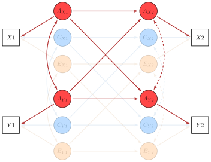

```{r, include = FALSE}
knitr::opts_chunk$set(
  collapse = TRUE,
  comment = "#>"
)
```

```{r, include = FALSE}
knitr::opts_chunk$set(
  collapse = TRUE,
  comment = "#>"
)
```

```{r include=FALSE, eval=FALSE}
# Converting pdf graphics to svg
pdfs <- list.files(pattern = '*.pdf$', recursive = TRUE)
svgs <- gsub('pdf$', 'svg', pdfs)

Map(function(i, o) {
  system(paste('pdf2svg', i, o))
}, pdfs, svgs)
```

1) Done - Start with phenotypic model. (Eg in black.)
2) The parameter estimates for long and cross-lag associations are different within each of the sub-models.
It would be interesting to start from phenotypic and decompose these to ACE.
3) Explain RAM decomposition, put labels in the matrices. Put the explanation to the end of the vignette.
4) Data structure. Put an example and the reference to another vignette.
5) Explain Saturated and Independence models.
6) Path estimates are standardized.
7) Provide an example of constraining the parameters.
8) Include the proportion of the path that explained by genetic and environmental relationships. Showing how to do it practically. The users can extend this. Include the proportion of phenotypic correlation accounted for all genetic and environmental latent relationships.
9) Show how the model can be extended to more measurement occasions and to more measures at each occasion.
10) Put the note about the intervals.
11) Put the reference to mlth.data.frame vignette and the note about writing to xlsx
12) Share latex code for the diagrams.
13) Write documentation for 'raw', 'cov' and 'cor' data
14) Check covariance data: all arguments in place for all groups, no missing means
if present at all, covariation matrices and means have same size and dimnames across
groups.
15) Is zygosity as factor (MZ/DZ) necessary for ACE/ADE models? Add to vignettes.
16) Study the case when variance component is constrained to (near) zero.

# Intro

Hi,

This is a vignette to illustrate an application of the cross-lag ACE model from [the `TwinAnalysis` package](https://ivanvoronin.github.io/TwinAnalysis/).

```{r, eval=FALSE, echo=FALSE}
# Here I simulate the cross-lag twin data
# The covariance matrices are simulated upon the results 
# from Cholesky ACE from the paper Malanchini et al. (2017)
vars <- c('Mot10', 'Ach10', 'Ach12', 'Mot12')

a <- matrix(c(
    0.57, 0   , 0   , 0   ,
    0.37, 0.51, 0   , 0   ,
    0.43, 0.30, 0.26, 0   ,
    0.50, 0.27, 0.39, 0.00),
  ncol = 4, nrow = 4, byrow = TRUE,
  dimnames = list(vars, vars))

c <- matrix(c(
    0.02, 0   , 0   , 0   ,
    0.00, 0.06, 0   , 0   ,
    0.00, 0.01, 0.00, 0   ,
    0.00, 0.00, 0.00, 0.00),
  ncol = 4, nrow = 4, byrow = TRUE,
  dimnames = list(vars, vars))

e <- matrix(c(
    0.82, 0   , 0   , 0   ,
    0.07, 0.77, 0   , 0   ,#    0.07, 0.58, 0   , 0   , 
    0.14, 0.09, 0.77, 0   ,
    0.22, 0.03, 0.32, 0.60),
  ncol = 4, nrow = 4, byrow = TRUE,
  dimnames = list(vars, vars))

A <- a %*% t(a)
C <- c %*% t(c)
E <- e %*% t(e)

V <- A + C + E
V[c('Mot10', 'Ach10', 'Mot12', 'Ach12'), c('Mot10', 'Ach10', 'Mot12', 'Ach12')]

cov_mz <- rbind(cbind(A + C + E, A + C),
                cbind(A + C, A + C + E))

cov_dz <- rbind(cbind(A + C + E, 0.5 %x% A + C),
                cbind(0.5 %x% A + C, A + C + E))

mz_data <- MASS::mvrnorm(2502, 
                         mu = rep(0, 8),
                         Sigma = cov_mz)
colnames(mz_data) <- paste0(vars, rep(1:2, each = length(vars)))

dz_data <- MASS::mvrnorm(4425, 
                         mu = rep(0, 8),
                         Sigma = cov_dz)
colnames(dz_data) <- paste0(vars, rep(1:2, each = length(vars)))

data <- rbind(cbind(zyg = 'MZ', as.data.frame(mz_data)),
              cbind(zyg = 'DZ', as.data.frame(dz_data)))

model <- cross_lag_ace(data, 'zyg',
                       list(c('Ach10', 'Mot10'), c('Ach12', 'Mot12')))

model <- mxTryHard(model)
```

# Phenotypic cross-lag

Cross-lag analysis usually starts with a phenotypic cross-lag model (the figure below). In this model, two traits `X` and `Y` are measured twice: `X1` and `Y1` at time 1 and `X2` and `Y2` at time 2. The model allows covariation between the variables within each measurement (two-way paths) and regression between the variables from the consecutive measurements (one-way paths).

The variability of `X2` and `Y2` is partially explained by the relationships of these two variables with `X1` and `X2`. The residual (or specific for time 2) variability of `X2` and `Y2` is not shown in the figure. The dashed covariation path between `X2` and `Y2` is what's left of the total covariation after taking into account the relationships with `X1` and `Y1`.


<br>*Path diagram for a phenotypic cross-lag model*


Let's simulate data and fit a phenotypic cross-lag model

```{r}
# Variance-covariance matrix for data simulation
V <- matrix(
  c(1.00, 0.27, 0.36, 0.46,
    0.27, 1.00, 0.39, 0.36,
    0.36, 0.39, 1.00, 0.68,
    0.46, 0.36, 0.68, 1.00),
  ncol = 4, nrow = 4,
  byrow = TRUE,
  dimnames = list(
    c('X1', 'Y1', 'X2', 'Y2'),
    c('X1', 'Y1', 'X2', 'Y2')
  )
)

data <- MASS::mvrnorm(7000, 
                      mu = rep(0, 4),
                      Sigma = V)
```


```{r}
library(OpenMx)
library(TwinAnalysis)

# cross_lag function makes a phenotypic cross-lag model
# The variables are passed in a list:
#   c('X1', 'Y1') for the variables at time 1
#   c('X2', 'Y2') for the variables at time 2
# Any number of measurement occasions 
#   and variables within each occasion
#   can be added this way
pheno <- cross_lag(data,
                   list(c('X1', 'Y1'),
                        c('X2', 'Y2')))

pheno2 <- cross_lag(data = list(observed = V, numObs = 1000),
                    list(c('X1', 'Y1'),
                         c('X2', 'Y2')),
                    data_type = 'cov')

pheno <- mxRun(pheno)
pheno2 <- mxRun(pheno2)

summary(pheno)
get_output_tables(pheno)

summary(pheno2)
get_output_tables(pheno2)
```


<br>*Path diagram for phenotypic cross-lag with path estimates*


# Cross-lag ACE

We use twin method to study what structure of genetic and environmental factors
explains phenotypic relationships between the variables within each measurement
and across measurement occasions. 

Here is a full cross-lag ACE model with four variables. Two traits `X` and `Y` are measured twice (`X1`, `Y1`, `X2`, `Y2`). Only one twin is shown on the path diagram.

{width=80%}

The model includes three sets of latent variables that correspond to the structure of genetic, shared environmental and non-shared environmental variability. Each set mirrors the cross-lagged structure of the data. Here are the parameters that represent genetic structure of the traits:

{width=80%}

The model allows correlations within each assessment ($r_1$, $r_2$) and regression paths from variables in one assessment to the variables in the following one ($k_{11}$, ... , $k_{22}$). The total variability of all latent variables is constrained to 1. $h_{X1}^2$, ... , $h_{Y2}^2$ represent the amount of genetic variability of corresponding traits.

I used the following model to simulate the data:

{width=80%}

{width=80%}

{width=80%}

The lengthy code that generates the data is below. It assumes that you have `OpenMx` installed. We will need it later anyway.
In the resulting data table, `X11` is trait `X` at the first assessment in the first twin, `X12` is trait `X` at the first assessment in the second twin, etc. `zyg` stands for zygosity (`MZ` or `DZ`).


```{r}
vars <- c('X1', 'Y1', 'X2', 'Y2')

I <- OpenMx::vec2diag(rep(1, 4))

A_A <- matrix(
  c(0.0, 0.0, 0.0, 0.0,
    0.0, 0.0, 0.0, 0.0,
    0.6, 0.3, 0.0, 0.0,
    0.4, 0.5, 0.0, 0.0
  ), ncol = 4, byrow = TRUE,
  dimnames = list(vars, vars))

A_S <- matrix(
  c(1.0, 0.8, 0.0,   0.0,
    0.8, 1.0, 0.0,   0.0,
    0.0, 0.0, 0.262, 0.1,
    0.0, 0.0, 0.1,   0.270
  ), ncol = 4, byrow = TRUE,
  dimnames = list(vars, vars))

A_V <- solve(I - A_A) %*% A_S %*% t(solve(I - A_A))


C_A <- matrix(
  c(0.0, 0.0, 0.0, 0.0,
    0.0, 0.0, 0.0, 0.0,
    0.7, 0.1, 0.0, 0.0,
    0.2, 0.5, 0.0, 0.0
  ), ncol = 4, byrow = TRUE,
  dimnames = list(vars, vars))

C_S <- matrix(
  c(1.0, 0.3, 0.0,   0.0,
    0.3, 1.0, 0.0,   0.0,
    0.0, 0.0, 0.458, 0.1,
    0.0, 0.0, 0.1,   0.650
  ), ncol = 4, byrow = TRUE,
  dimnames = list(vars, vars))

C_V <- solve(I - C_A) %*% C_S %*% t(solve(I - C_A))


E_A <- matrix(
  c(0.0, 0.0, 0.0, 0.0,
    0.0, 0.0, 0.0, 0.0,
    0.2, 0.0, 0.0, 0.0,
    0.0, 0.2, 0.0, 0.0
  ), ncol = 4, byrow = TRUE,
  dimnames = list(vars, vars))

E_S <- matrix(
  c(1.0, 0.1, 0.0,   0.0,
    0.1, 1.0, 0.0,   0.0,
    0.0, 0.0, 0.960, 0.0,
    0.0, 0.0, 0.0,   0.960
  ), ncol = 4, byrow = TRUE,
  dimnames = list(vars, vars))

E_V <- solve(I - E_A) %*% E_S %*% t(solve(I - E_A))

vcomp <- matrix(
  c(0.5, 0.4, 0.6, 0.4,
    0.3, 0.2, 0.2, 0.2,
    0.2, 0.4, 0.2, 0.4),
  ncol = 3,
  dimnames = list(vars, c('A', 'C', 'E'))
)

A <- (sqrt(vcomp[, 'A']) %*% t(sqrt(vcomp[, 'A']))) * A_V 
C <- (sqrt(vcomp[, 'C']) %*% t(sqrt(vcomp[, 'C']))) * C_V
E <- (sqrt(vcomp[, 'E']) %*% t(sqrt(vcomp[, 'E']))) * E_V

cov_mz <- rbind(cbind(A + C + E, A + C),
                cbind(A + C, A + C + E))
cov_dz <- rbind(cbind(A + C + E, 0.5 %x% A + C),
                cbind(0.5 %x% A + C, A + C + E))

dimnames(cov_mz) <- dimnames(cov_dz) <- 
  list(paste0(vars, rep(1:2, each = length(vars))), 
       paste0(vars, rep(1:2, each = length(vars))))

mz_data <- MASS::mvrnorm(10000, 
                         mu = rep(0, 8),
                         Sigma = cov_mz)

dz_data <- MASS::mvrnorm(10000, 
                         mu = rep(0, 8),
                         Sigma = cov_dz)

data <- rbind(cbind(zyg = 'MZ', as.data.frame(mz_data)),
              cbind(zyg = 'DZ', as.data.frame(dz_data)))
```

```{r}
require(glue)

definition = list(c('X1', 'Y1'), c('X2', 'Y2'))
zyg = 'zyg'

twmodel <- cross_lag_ace(data,
                         zyg = 'zyg',
                         definition = list(c('X1', 'Y1'),
                                           c('X2', 'Y2')))

twmodel <- mxRun(twmodel)

get_output_tables(twmodel)
```


Now we can apply the cross-lag ACE model to the data. The argument `defintion` is a list with the vectors with variable names from each one measurement occasion. Otherwise, the model works just like any other model from `TwinAnalysis` package, refer to another vignette. I present here a minimal example of the application of cross-lag ACE.

```{r}
library(OpenMx)
library(TwinAnalysis)

model <- cross_lag_ace(data, zyg = 'zyg',
                       definition = list(c('X1', 'Y1'),
                                         c('X2', 'Y2')))

model <- mxRun(model)
# model <- mxRun(model, intervals = TRUE)

model <- ref_models(model)

# To fit assumption constrained reference models:
# model <- twin_ref_models(model, run = TRUE)

# Fit statistics
fit_stats(model)

# Parameter tables
get_output_tables(model)
```

$$ \Sigma{}_{MZ} = \begin{pmatrix}  V_A + V_C + V_E & V_A + V_C \\
                                  V_A + V_C & V_A + V_C + V_E \end{pmatrix} $$

$$ \Sigma{}_{DZ} = \begin{pmatrix}  V_A + V_C + V_E & 0.5\times{}V_A + V_C \\
                                  0.5\times{}V_A + V_C & V_A + V_C + V_E \end{pmatrix} $$

$$ V_A = (I - A_A)^{-1}S_A(I - A_A)^{-1\top} \\
   V_C = (I - A_C)^{-1}S_C(I - A_C)^{-1\top} \\
   V_E = (I - A_E)^{-1}S_E(I - A_E)^{-1\top} $$
$$ V_{total} = V_A + V_C + V_E $$

$$ Variance\ components = 
  \begin{pmatrix} \frac{diag(V_A)}{diag(V_{total})} & 
                                          \frac{diag(V_C)}{diag(V_{total})} & 
                                          \frac{diag(V_E)}{diag(V_{total})} &
                                          \frac{diag(S_A)}{diag(V_{total})} & 
                                          \frac{diag(S_C)}{diag(V_{total})} & 
                                          \frac{diag(S_E)}{diag(V_{total})} \\
  \end{pmatrix}
  

$$


$$ SD_A = \sqrt{I\times{}V_A} \\
   SD_C = \sqrt{I\times{}V_C} \\ 
   SD_E = \sqrt{I\times{}V_E} $$


Output tables:

- __`Variance_components`__: `Atot`, `Ctot` and `Etot` are the standardized estimates of genetic and environmental contributions. `Acom`, `Ccom` abd `Ecom` are genetic and environmental contributions accounted for by the factors from the previous measurement occasion. For the first measurement occasion, there is no previous one, so `Acom`, `Ccom` and `Ecom` for `X1` and `X2` are zeros. `Ares`, `Cres` and `Eres` are the factors that remained unaccounted for by the previous measurement occasion. Each `com` and `res` sum up to `tot` and `Atot`, `Ctot` and `Etot` sum up to 1, the total variability of the corresponding measure.

- __`Path_estimates`__: Each column `A`, `C` and `E` stands for the corresponding part of the twin model. Each row represents a parameter from the cross-lag model. For example, the genetic stability of `X`, denoted as `X1 --> X2`, is `r sprintf('%0.3f', get_output_tables(model)$Path_estimates['X1 --> X2', 'A'])`. The genetic correlation between `X` and `Y` in the first measurement occasion, denoted as `X1 <-> Y1`, is `r sprintf('%0.3f', get_output_tables(model)$Path_estimates['X1 <-> Y1', 'A'])`. Mind, that the total variance of the latent variables is constrained to 1 and the variance parameters in the table (`X1 <-> X1`,  `Y1 <-> Y1` etc) are residual (novel) variability, not total. In the first measurement occasion, all variability is novel, this is why all `X1 <-> X1` and `Y1 <-> Y1` are 1. It is not so for `X2 <-> X2` and `Y2 <-> Y2` because some part of variance of `X2` and `Y2` is explained by `X1` and `Y1`.

# Note: 

at the moment, `mxCheckIdentification()` doesn't work on the cross-lag ACE and `mxTryHard()` doesn't run the fitting repeatedly if the model status is red.
